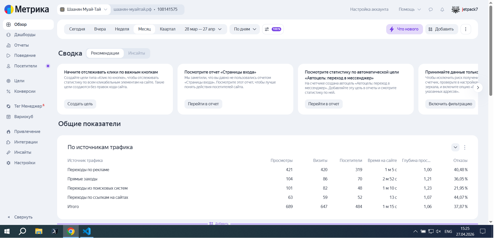
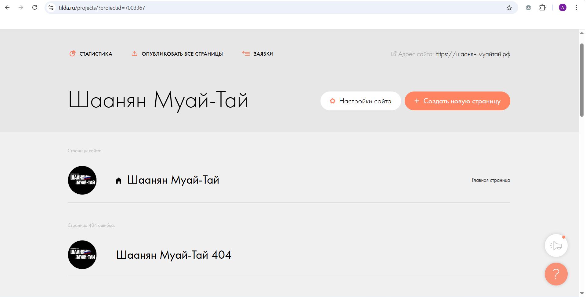
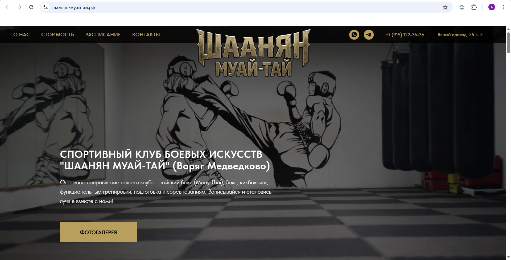

# 🥊 Проект: Запуск и SEO-оптимизация сайта спортивного клуба «Шаанян Муай-Тай»

**Статус:** ✅ Проект завершён, сайт запущен в промышленную эксплуатацию

---

## 📌 Оглавление

1. [Описание проекта](#-описание-проекта)
2. [Задачи и цели](#-задачи-и-цели)
3. [Технологический стек](#-технологический-стек)
4. [Этапы выполнения](#-этапы-выполнения)
   - [1. Ребрендинг и адаптация контента](#1-ребрендинг-и-адаптация-контента)
   - [2. Техническая подготовка к запуску](#2-техническая-подготовка-к-запуску)
   - [3. SEO-оптимизация](#3-seo-оптимизация)
   - [4. Настройка аналитики и инструментов вебмастера](#4-настройка-аналитики-и-инструментов-вебмастера)
   - [5. Решение нестандартных задач](#5-решение-нестандартных-задач)
5. [Результаты](#-результаты)
6. [Скриншоты](#️-скриншоты)
7. [Заключение и выводы](#-заключение-и-выводы)

---

## 📖 Описание проекта

Спортивный клуб единоборств «Варяг Медведково» прошёл ребрендинг и сменил название на **«Шаанян Муай-Тай»**.  
В рамках проекта требовалось:

- Обновить сайт клуба в соответствии с новым названием
- Сменить доменное имя и настроить безопасное соединение
- Провести полную SEO-оптимизацию для продвижения в Яндекс и Google
- Настроить системы аналитики для отслеживания эффективности
- Создать визуальные элементы (логотип, фавикон) в новом стиле

Сайт был разработан на платформе **Tilda Publishing**. Вся работа выполнена удалённо, с полным контролем технических аспектов и взаимодействием с заказчиком.

---

## 🎯 Задачи и цели

| Задача | Результат |
|--------|----------|
| Ребрендинг и копирование структуры | Создана новая версия сайта с актуальным названием и контентом |
| Подключение нового домена | Выбран и настроен домен `шаанян-муайтай.рф` |
| Настройка HTTPS | SSL-сертификат успешно установлен и автоматически продлевается |
| SEO-оптимизация | Прописаны заголовки, мета-теги, alt-атрибуты для всех изображений |
| Индексация в поисковых системах | Сайт добавлен в Яндекс.Вебмастер и Google Search Console |
| Аналитика | Установлен счётчик Яндекс.Метрики, настроено отслеживание целей |
| Визуальное оформление | Созданы новый логотип (русскоязычный) и фавикон в едином стиле |
| Карточка организации | Обновлены данные в Яндекс.Бизнесе: адрес, сайт, часы работы |

---

## 🛠 Технологический стек

| Категория | Инструменты |
|-----------|-------------|
| **Конструктор** | Tilda Publishing |
| **Домены и DNS** | Reg.ru, настройка NS-серверов Тильды, A-записи |
| **Графика** | Photopea, Favicon.io, Nano Banana 2 (нейросеть) |
| **Аналитика** | Яндекс.Метрика |
| **Поисковые системы** | Яндекс.Вебмастер, Google Search Console |
| **SEO** | Tilda (мета-теги, заголовки, alt-атрибуты), ручная проверка |
| **Организации** | Яндекс.Бизнес |

---

## 🚀 Этапы выполнения

### 1. Ребрендинг и адаптация контента

- Создана копия существующего сайта на платформе Tilda
- Вручную скорректированы все текстовые блоки под новое название клуба
- Обновлены фотографии, добавлены новые изображения из актуальной жизни клуба
- Написаны уникальные тексты для разделов «О клубе», «Преимущества», «Тренер»

**Генерация логотипа:**
- Использована нейросеть **Nano Banana 2** для создания брутального логотипа в тайском стиле
- Логотип выполнен в двух вариантах (английский и русский), финально утверждён русскоязычный вариант
- Цветовая гамма: чёрный фон + золото (`#b99f5d`) с белыми акцентами

**Создание фавикона:**
- В **Nano Banana 2** сгенерировано стилизованное изображение тайского боксера, обработано в Photopea
- Создана иконка в формате `favicon.ico` (32×32 px), загружена в настройки сайта
- Файл доступен по адресу `https://шаанян-муайтай.рф/favicon.ico` (HTTP 200 OK)

### 2. Техническая подготовка к запуску

**Доменное имя:**
- Приобретён домен `шаанян-муайтай.рф` на Reg.ru
- В настройках DNS-серверы заменены на NS-серверы Тильды:
ns1.tildadns.com
ns2.tildadns.com
text

**HTTPS:**
- После делегирования домена автоматически запрошен и установлен SSL-сертификат Let's Encrypt
- Сайт доступен по защищённому протоколу `https://`, зелёный замочек в браузере подтверждает корректность настройки

**Публикация:**
- Выполнена переопубликация всех страниц после каждого изменения

### 3. SEO-оптимизация

**Структура заголовков:**
- **H1** — `СПОРТИВНЫЙ КЛУБ БОЕВЫХ ИСКУССТВ "ШААНЯН МУАЙ-ТАЙ"` (только один на странице)
- **H2** — заголовки разделов: «Преимущества обучения», «Арам Шаанян», «Стоимость абонементов», «РАСПИСАНИЕ ТРЕНИРОВОК»
- **H3** — подзаголовки внутри преимуществ занятий в клубе (6 пунктов)

**Мета-теги для главной страницы:**
```html
<title>Тайский бокс в Медведково | Школа муай-тай «Шаанян Муай-Тай» (СВАО)</title>

<meta name="description" content="Тайский бокс в Медведково (СВАО). Клуб «Шаанян Муай-Тай» — новый зал, опытные тренеры. Группы для детей и взрослых, персональные тренировки. Приходи на бесплатное пробное занятие!">

<meta name="keywords" content="тайский бокс, муай тай, muay thai, спортивный клуб боевых искусств, школа единоборств, тренировки, Шаанян Муай-Тай, Медведково, СВАО, Москва">
```

**Alt-атрибуты для изображений**

Прописаны для всех ключевых изображений:
- Логотип
- Фото тренера
- Галерея (5 изображений с уникальными описаниями)
- Фоновые изображения обложек и блоков
- Каноническая ссылка:
    - Добавлена в настройках страницы — https://шаанян-муайтай.рф/ (после полного переезда)

### 4. Настройка аналитики и инструментов вебмастера

**Яндекс.Метрика:**
- Создан счётчик
- Код счётчика вставлен в настройках Тильды (раздел «Аналитика»)
- Проверка: через `?_ym_debug=2` подтверждена корректная работа

**Яндекс.Вебмастер:**
- Добавлен сайт https://шаанян-муайтай.рф
- Подтверждение прав через DNS-запись (автоматически через Тильду, после настройки NS-серверов)
- Добавлен файл sitemap.xml (сформирован автоматически Тильдой)

**Google Search Console:**
- Подключение выполнено через встроенный инструмент Тильды (кнопка «Подключить»)
- Подтверждение прав выполнено автоматически
- Отправлен на переобход главной страницы для ускорения индексации
- Дополнительно добавлен sitemap.xml

**Яндекс.Бизнес (карточка организации):**
- Обновлена ссылка на сайт: https://шаанян-муайтай.рф
- Актуализированы контакты, адрес, часы работы
- Изменения прошли модерацию

### 5. Решение нестандартных задач

**Проблема с читаемостью логотипа:**
- Логотип, сгенерированный нейросетью, на светлом фоне терял контрастность
    - Решение: добавлена тонкая чёрная обводка в Photopea, улучшен контраст

**Пикселизация при обрезке логотипа:**
- При вырезании текста из исходного изображения терялось качество
    - **Решение:** обрезка через «Trim» в Photopea с сохранением исходного разрешения, затем экспорт в PNG

**Ошибка интеграции Тильды с Яндекс.Вебмастером:**
- Тильда показывала `expired_token` и дублировала сайт с `www` и без
    - **Решение:** ручное удаление лишней записи в Вебмастере, повторное добавление сайта через интерфейс Яндекса, отключение интеграции в Тильде (она не обязательна для работы)

**Фавикон не обновлялся в поисковой выдаче:**
- После замены файла Google и Яндекс продолжали показывать старую иконку
    - **Решение:** отправка главной страницы на переобход в обеих системах, ожидание (2–3 недели), проверка доступности favicon.ico (HTTP 200 OK)

**Страница 404 в Google Search Console:**
- Консоль показывала ошибку Заблокировано в robots.txt
    - **Решение:** объяснено, что это штатное поведение (404 не должна индексироваться), удалена ссылка на неё из меню, статус сброшен через «Проверить исправление»

## 📊 Результаты

### Технические показатели

|Параметр|Значение|
|--------|--------|
|Доступность по HTTP/HTTPS|✅ оба протокола работают, принудительное перенаправление на HTTPS|
|SSL-сертификат|✅ Let's Encrypt, автоматическое продление|
|DNS|✅ NS-серверы Тильды, A-записи для www и без www|
|Файл robots.txt|✅ доступен, закрывает служебные страницы|
|Sitemap.xml|✅ доступен, добавлен в Вебмастер|
|Яндекс.Метрика|✅ код установлен, данные собираются (112 визитов за 5 дней после запуска)|
|Яндекс.Вебмастер|✅ сайт добавлен, подтверждён, отправлены sitemap и страницы на переобход|
|Google Search Console|✅ сайт добавлен, подтверждён, отправлены sitemap и страницы на переобход|
|Яндекс.Бизнес|✅ карточка обновлена, ссылка на сайт актуальна|
|Favicon|✅ доступен по адресу `/favicon.ico`, 200 OK, ожидается обновление в выдаче|

### SEO-показатели

|Параметр|Статус|
|--------|------|
|H1|✅ один на странице, содержит ключевые слова|
|H2–H3|✅ иерархия соблюдена|
|Мета-описание|✅ заполнено, уникальное|
|Alt-теги|✅ прописаны для всех значимых изображений|
|Структура URL|✅ человеко-понятная, на русском языке|
|Мобильная адаптация|✅ встроенными средствами Tilda|

### Бизнес-показатели (первые 5 дней)

|Показатель|Значение|
|----------|--------|
|Визиты в Метрике|112|
|Просмотры|>150|
|Среднее время на сайте|данные накапливаются|

### UPD. Значения на 27.04.2026

Прошел месяц после запуска сайта на новом домене. Так же около двух недель назад была подключена и настроена реклама в **Яндекс.Директ**.

Данные с **Яндекс Метрики:**

**По источникам трафика**

|Источник трафика|Просмотры|Визиты|Посетители|
|----------------|---------|------|----------|
|Переходы по рекламе|421|420|319|
|Прямые заходы|104|86|70|
|Переходы из поисковых систем|101|82|48|
|Переходы по ссылкам на сайтах|63|59|52|
|Итого|689|647|484|

_Среднее время на сайте: 1м 15с_

## 🖼️ Скриншоты

_Метрики_



_Тильда_



_Сайт_



## 🧾 Заключение и выводы

Проект успешно завершён. Все поставленные задачи выполнены:
- ✅ Сайт полностью адаптирован под новое название клуба
- ✅ Выполнен переезд на новый домен с сохранением структуры
- ✅ Проведена глубокая SEO-оптимизация
- ✅ Настроены инструменты аналитики и вебмастера
- ✅ Созданы визуальные элементы (логотип, фавикон) в едином стиле
- ✅ Обновлена карточка организации в Яндекс.Бизнесе

Ключевые выводы для дальнейшей работы:

Индексация нового сайта занимает от 2 до 4 недель — процесс идёт, страницы постепенно появляются в выдаче

Обновление фавикона в поисковых системах требует времени и терпения; важно убедиться, что файл доступен (HTTP 200)

Встроенная интеграция Тильды с Яндекс.Вебмастером может работать нестабильно — лучше управлять сайтом напрямую через интерфейс Яндекса

404 страница не должна быть в индексе, её статус в Google Search Console — не ошибка, а норма

📅 Дата завершения проекта: март 2026  
👤 Исполнитель: Гайнутдинов Андрей Валерьевич  
📁 Репозиторий: https://github.com/jetpackfm/muay-thai-club-relaunch  
🌐 Сайт: https://xn----7sbaba7cbuha3dj2dvf.xn--p1ai/

Проект подготовлен для портфолио и демонстрирует навыки комплексного управления сайтом: от технической настройки до SEO и работы с графикой.

© 2026 Андрей Гайнутдинов. Все права защищены. Проект представлен в ознакомительных целях как часть портфолио.
